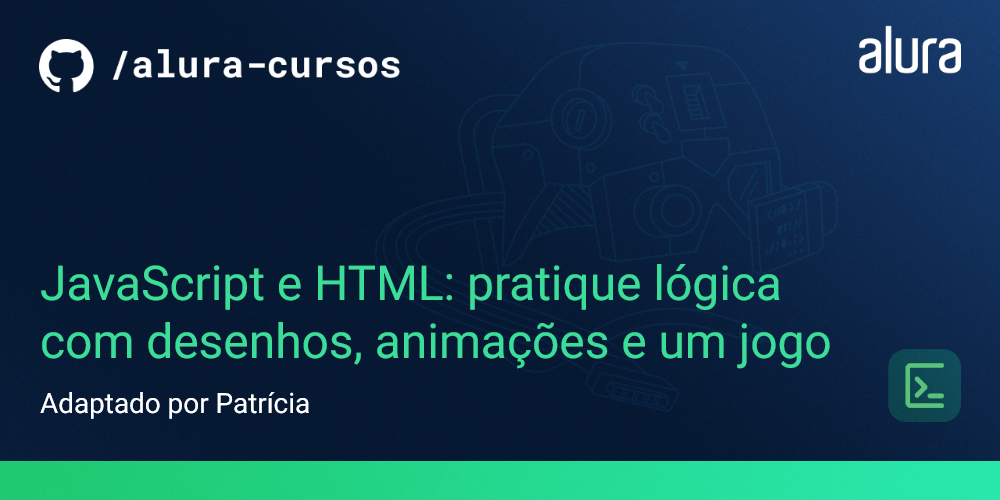
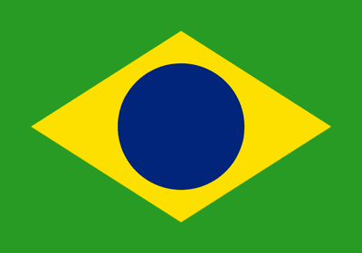
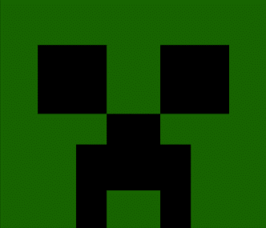
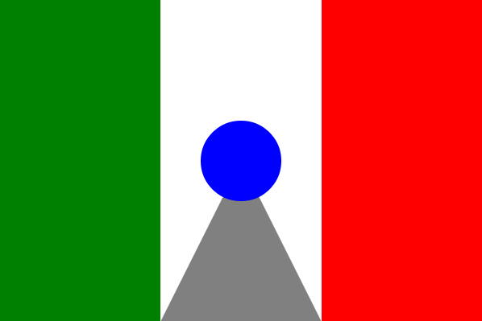
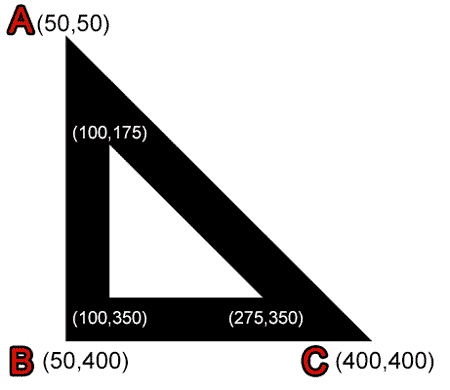
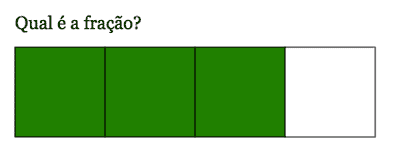

  

O jogo desenvolvido foi um jogo para acertar o alvo na tela, assim que você consegue clicar no centro do alvo, é disparado um pop-up na tela informando que o jogador acertou o alvo.  
 

Outros desenhos como alguns apresentados abaixo também foram criados durante o curso:  
 
  
  
  
  
  
  

Este projeto faz parte do curso de JavaScript e HTML da Alura.  
A carga horária do curso é de 10 horas e seu conteúdo inclui:

- Continuação da prática de lógica com JavaScript.
- Utilização de funções para facilitar o trabalho.
- Conhecimento sobre Canvas para gerar desenhos e animações.
- Revisão de conceitos importantes na programação.
- Criação de um jogo.

## Tecnologias utilizadas

As tecnologias utilizadas no projeto são:

- JavaScript
- Canvas API

## Como executar o projeto no seu computador

Para executar o projeto, basta fazer o clone do repositório e abrir o arquivo index.html no seu navegador.

## 📁 Acesso ao projeto

Você pode [baixá-lo](https://github.com/patyfil/javascript-canvas/archive/refs/heads/main.zip) ou visualizá-lo em funcionamento em [link para o projeto em funcionamento]().

## 📚 Mais informações do curso

Gostou do projeto e quer conhecer mais? Você pode [acessar o curso](https://cursos.alura.com.br/course/logica-programacao-pratica-com-desenho-animacoes-em-jogo) que desenvolve o projeto desde o começo!

## Licença

Este projeto está sob a licença do MIT. Para mais informações, consulte o arquivo LICENSE no diretório raiz do projeto.
